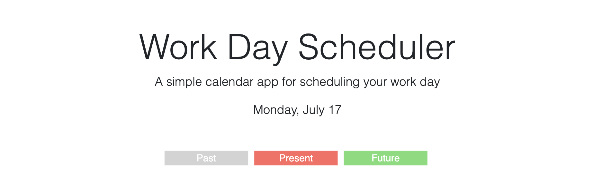
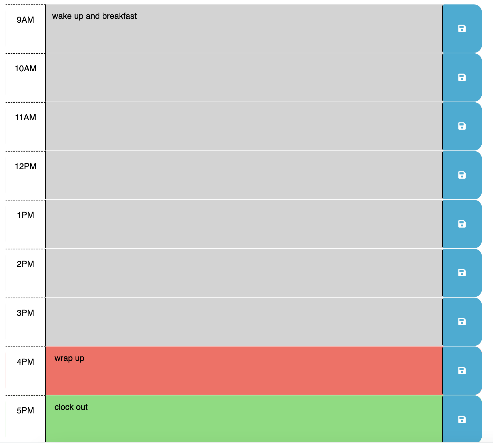

# Work Day Scheduler

## Description

- Create a scheduler that displays events that happen throughout the day ☀️
- Events are color coded based on the current hour, depending on if they are in the past, present or future:
  -  `events in the past`
  -  `events in the present hour`
  -  `events in the future`
- You can save events which will be stored in localStorage 📋

## Link to deployed application
https://matthkang.github.io/workday-scheduler/

## Table of Contents (Optional)

- [Usage](#usage)
- [Credits](#credits)

## Usage
Work Day Scheduler with current day and color coded events based on current time

## Credits

- https://stackoverflow.com/questions/30237338/how-to-get-id-of-div-on-click-of-button-inside-it
- https://stackoverflow.com/questions/48239/getting-the-id-of-the-element-that-fired-an-event
- https://www.freecodecamp.org/news/how-to-convert-a-string-to-a-number-in-javascript/
- https://www.w3schools.com/jsref/jsref_substring.asp
